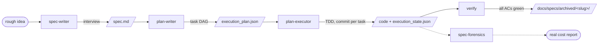

# sdd-kit

**Spec-driven development for coding agents** — a pipeline of skills that
carries a feature from a rough idea to verified, committed code through four
explicit stages, where every hand-off is a file on disk, not a conversation.

[](CHANGELOG.md)
[](https://github.com/dmarchena/agent-plugins/actions/workflows/ci.yml)
[](../../LICENSE)

> Instead of vibe-coding a feature and hoping, sdd-kit locks scope down
> **before** any code exists: an interview produces a testable `spec.md`, a
> planner turns it into a validated task DAG, an executor implements each
> task via TDD with one commit per task, and a verifier only archives the
> feature when every acceptance criterion is green. Deterministic scripts —
> not LLM judgment — gate every transition.

## The pipeline



| Stage | Skill | Consumes → Produces | Guarantee |
|-------|-------|---------------------|-----------|
| **spec** | [`spec-writer`](skills/spec-writer/SKILL.md) | interview → `spec.md` | One-question-at-a-time interview yielding purpose, scope/non-goals, requirements with Given/When/Then scenarios, a technical section, and a flat acceptance-criteria checklist. Stops there — no plan, no code. |
| **plan** | [`plan-writer`](skills/plan-writer/SKILL.md) | `spec.md` → `execution_plan.json` | A DAG of atomic tasks with dependencies, per-task agent/model assignment, token budgets, and full traceability — every `R<n>` and `AC<n>` covered by at least one task, enforced by a deterministic validator. |
| **exec** | [`plan-executor`](skills/plan-executor/SKILL.md) | plan + spec → tested, committed code | Runs the DAG in dependency order, dispatching each task to its assigned subagent/model via TDD (red → green), verifying deterministically, committing per task on the plan's own branch, and journaling progress in `execution_state.json` so a run can pause and resume. |
| **verify** | [`verify`](skills/verify/SKILL.md) | spec + plan + state → verdict / archive | Checks the spec's acceptance criteria one by one, cross-checks coverage, gates on the repo's versioning policy, and archives the spec directory **only** when everything is green. |
| *(audit)* | [`spec-forensics`](skills/spec-forensics/SKILL.md) | `execution_state.json` → cost report | Reports the **real** per-task token/cost figures from session transcripts — orchestrator vs subagents breakdown, deviation against the plan's estimates. Read-only. |

## Install

```sh
claude plugin marketplace add dmarchena/agent-plugins
claude plugin install sdd-kit@agent-plugins
```

Then restart your session (or `/reload-plugins`). Requires Node.js for the
plugin's deterministic scripts.

## Quick start

Each stage has a slash-command shortcut; the underlying skills also trigger
on natural requests ("write me a spec for…", "ejecuta el plan").

```text
/sdd-kit:spec feat add rate limiting to the public API   # interview → spec.md
/sdd-kit:plan docs/specs/rate-limiting/spec.md            # spec → execution_plan.json
/sdd-kit:exec docs/specs/rate-limiting/                   # plan → code, commit per task
# then: "verify docs/specs/rate-limiting/"                # ACs → archive when green
/sdd-kit:forensics docs/specs/rate-limiting/              # real cost vs estimates
```

## Where the artifacts live

Every feature gets one directory — **`docs/specs/<slug>/`** — holding the
whole chain's artifacts together, following the standard SDD layout used by
spec-kit and Kiro (rationale in [ADR 0001](docs/adr/0001-artifact-location.md)):

```text
docs/specs/<slug>/
├── spec.md               # spec-writer
├── execution_plan.json   # plan-writer
└── execution_state.json  # plan-executor (progress journal, enables resume)
```

While in progress, the directory is committed on the feature branch — **git
is the hand-off between stages and sessions, not the conversation**. On
completion, `verify` moves it to `docs/specs/archived/<slug>/`: the spec
remains the durable record of intended behavior without every future session
paying its context cost.

## Shared ID scheme

All stages key off the same IDs, so later stages reference structure instead
of re-quoting prose:

- **`R<n>`** — a functional requirement, with an explicit dependency line.
- **`R<n>.S<m>`** — a Given/When/Then scenario under that requirement.
- **`AC<n>`** — an acceptance-criteria entry pointing back to the scenario it
  checks, tagged `[auto]`/`[manual]`.

`spec-writer` mints the IDs; `plan-writer` proves coverage of every one;
`plan-executor` traces each task back to them; `verify` walks the `AC<n>`
checklist to decide completion.

## Deterministic by design

Every gate in the pipeline is a script, not a prompt:

- **`scripts/plan-tools.mjs`** — validates specs (`inspect-spec`) and plans
  (`check-plan`): JSON Schema, DAG acyclicity, R/AC coverage.
- **`scripts/exec-tools.mjs`** — drives execution state: next runnable tasks,
  task completion (refusing to record a delegated task without its agent id),
  scoped per-task commits, resume after interruption.
- **`scripts/verify-tools.mjs`** — parses and checks the AC checklist, then
  performs the archive move.
- **`scripts/forensics.mjs`** — computes real per-task cost from transcripts.

Every CLI prints a single canonical envelope on stdout —
`{ ok: true, data: … }` or `{ ok: false, error: … }` — documented in
[`docs/cli-data-contract.md`](docs/cli-data-contract.md), so any stage (or
your own tooling) can consume any other stage mechanically. The scripts are
covered by an extensive Node test suite under [`test/`](test/), run in CI.

## Cost-aware planning

`plan-writer` estimates a token budget per task (calibrated against snapshots
of previously executed plans), `plan-executor` guards against runaway spend,
and `spec-forensics` closes the loop by reporting what each task **actually**
cost — so estimates improve with every executed spec.

## Agent compatibility

Markdown + Node scripts, agent-agnostic. The skills target Claude Code's
skill format (`SKILL.md` + `assets/`), but their instructions assume no
Claude-specific runtime beyond a coding agent that can read/write files, run
a script, and (for `spec-writer`) ask the user questions. Cross-platform
manifests for Codex are generated under `.codex-plugin/`.

## License

[MIT](../../LICENSE) — part of the [`agent-plugins`](../../README.md)
marketplace.
